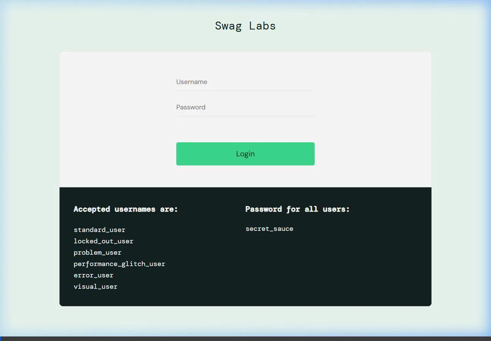
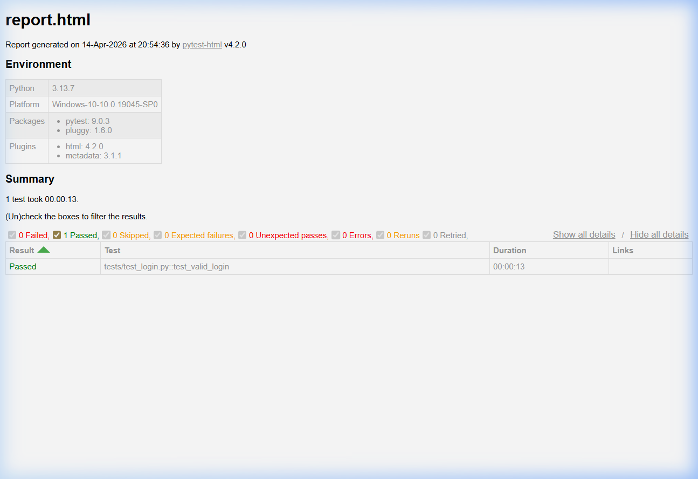

# E-commerce Automation Framework 🚀

A modern, scalable Selenium WebDriver automation framework built in Python. Features include a modular Page Object Model (POM) and robust, portfolio-style HTML reporting.

---

### ⚡ Quick Actions
[](https://ans422.github.io/ecommerce-automation-framework/report.html)
[](https://github.com/codespaces/new/ans422/ecommerce-automation-framework?hide_repo_select=true&ref=main)

---
Watch the automated login test in action:



## 📊 Test Reporting
Beautiful HTML reports generated automatically showing test execution and results:



---

## 🛠️ Tech Stack
- **Python** (3.13+)
- **Selenium WebDriver** (Browser Automation)
- **PyTest** (Test Runner)
- **Webdriver Manager** (Automatic Driver Setup)

## ✨ Features
- Structured Page Object Model (POM)
- Scalable test directory hierarchy
- Zero-config automatic browser configuration
- Built-in HTML reporting

## 🚀 How to Run

1. Clone the repository and install dependencies:
```shell
pip install -r requirements.txt
```

2. Execute the tests and generate the HTML report:
```shell
pytest -v --html=reports/report.html
```
